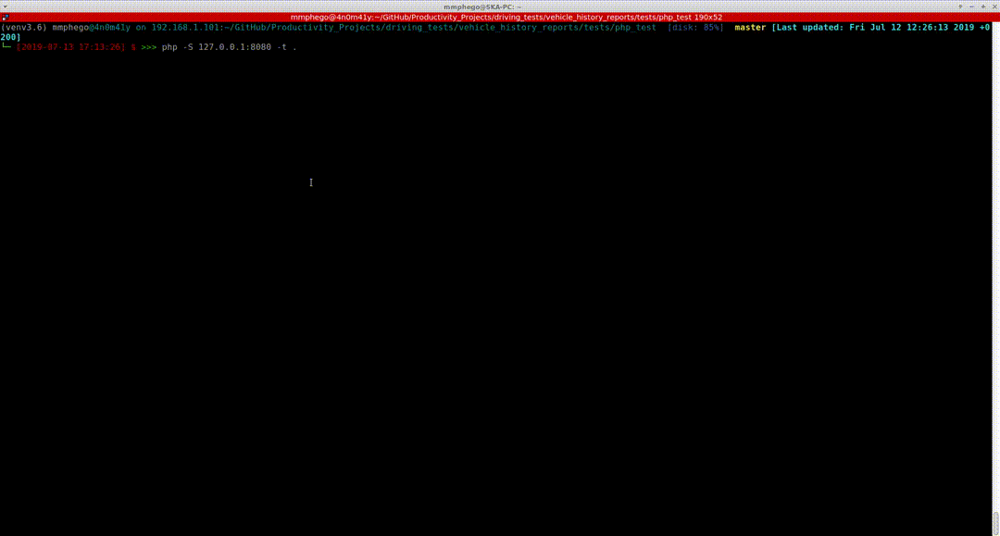

# Vehicle History Reports

[](https://travis-ci.com/mmphego/vehicle_history_reports)
[](https://www.python.org/downloads/)

Web scrapping tool for Vehicle information by VIN number

# Installation

Before you install ensure that `geckodriver` for Firefox is installed.

 - Download [geckodriver](https://github.com/mozilla/geckodriver)
	 -  ```wget https://github.com/mozilla/geckodriver/releases/download/v0.24.0/geckodriver-v0.24.0-linux64.tar.gz```
- Extract: ```tar -xvzf geckodriver-v0.24.0-linux64.tar.gz```
-  `sudo cp geckodriver /usr/local/bin`

To install Vehicle History Reports, run this command in your bash terminal:

```python
    pip install -U .
```

This is the preferred method to install Vehicle History Reports, as it will always install the most recent stable release.

# Usage

```bash
usage: vin_scrapper.py [-h] --vin-numbers VIN_NUMBERS [VIN_NUMBERS ...]
                       [--no-headless] [--no-json-output] [--host HOST]
                       [--port PORT] [--username USERNAME]
                       [--password PASSWORD] [--loglevel LOG_LEVEL]

Web scrapping tool for Vehicle information by VIN number

optional arguments:
  -h, --help            show this help message and exit
  --vin-numbers VIN_NUMBERS [VIN_NUMBERS ...], -v VIN_NUMBERS [VIN_NUMBERS ...]
                        A list of VIN numbers.
  --no-headless         Do not open browser in headless mode.
  --no-json-output, -j  Output as json.
  --host HOST           Proxy address.
  --port PORT           Proxy port.
  --username USERNAME   Username to access proxy.
  --password PASSWORD   Password to access proxy.
  --loglevel LOG_LEVEL  log level to use, default [INFO], options [INFO,
                        DEBUG, ERROR]
```

Example:
`vin_scrapper.py --vin-numbers 3AKJGLD57FSGD1225 --host 23.94.44.65 --port 10998`

## Usage with PHP

**Example**:

Copy below code to `run.php`

```php
<html>
 <body>
  <head>
   <title>
     run
   </title>
  </head>

   <form method="post">

    <input type="submit" value="GO" name="GO">
   </form>
 </body>
</html>

<?php
    if(isset($_POST['GO']))
    {
      $message = shell_exec("python3 /usr/local/bin/vin_scrapper.py --vin-numbers JN8AZ2NC3G9400704 --host 23.94.44.65 --port 10998");
      print_r($message);
    }
?>

```
Run php:
`php -S 127.0.0.1:8080 -t .`

then in your browser goto: http://localhost:8080/run.php hit `Go` and see the scrapping....

# Demo



# Oh, Thanks!

By the way...
Click if you'd like to [saythanks](https://saythanks.io/to/>mmphego)... :) else *Star* it.

✨🍰✨
